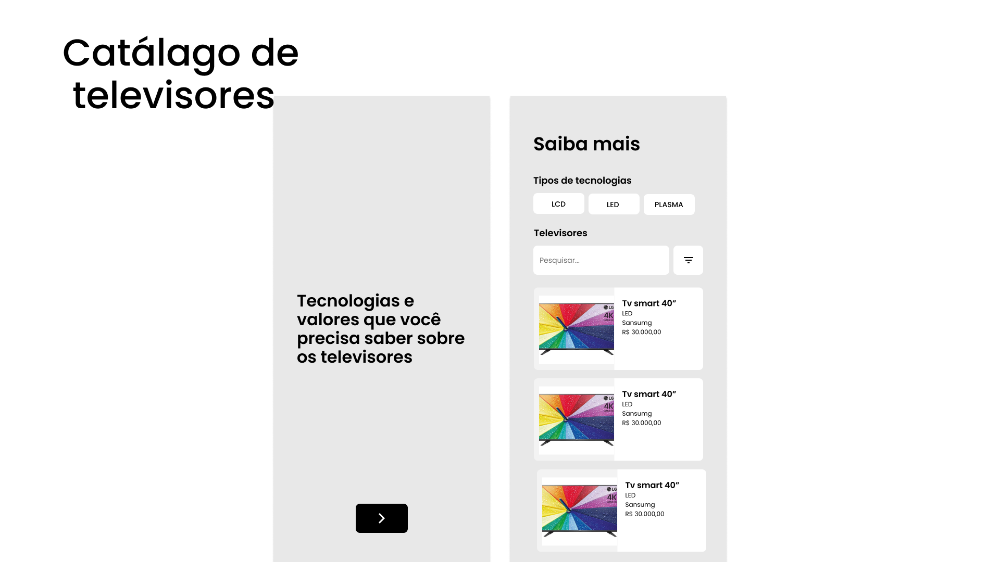

  <h1>Catálago de televisores</h1>

  <a href="#-tecnologias">Tecnologias</a>&nbsp;&nbsp;&nbsp;|&nbsp;&nbsp;&nbsp;
  <a href="#-projeto">Projeto</a>&nbsp;&nbsp;&nbsp;|&nbsp;&nbsp;&nbsp;
  <a href="#-projeto">Layout</a>&nbsp;&nbsp;&nbsp;|&nbsp;&nbsp;&nbsp;
  <a href="#-projeto">Instalação</a>&nbsp;&nbsp;&nbsp;|&nbsp;&nbsp;&nbsp;
  <a href="#-layout">Demo</a>

 

  

## 🚀 Tecnologias

Esse projeto foi desenvolvido com as seguintes tecnologias:

- React Native
- Expo
- React navigation
- Axios
- Nodejs
- Expressjs

## 💻 Projeto

O catálago de televisores é uma aplicação que tem como objetivo participar da 2° etapa de seleção para desenvolvedor react native.

## 🔖 Layout

No link abaixo você encontra o layout do projeto mobile. Lembrando que você precisa ter uma conta no [Figma](http://figma.com/) para acessá-lo.

- [Layout Mobile](https://www.figma.com/file/IG3FTqZ9zpRNtnRUZvdoVq/catalago-de-televisores)

## Instalação

- Você precisa do nodejs e do expo-cli na sua máquina
- Clone o repositório do git
- Instale as dependências com yarn dentro de cada diretório (backend e mobile)
- Modifique a baseURL do axios no projeto mobile de acordo com o (Metro waiting on exp://192.168.37.16:19000)
- E execute yarn start em ambos

## Demo do aplicativo

- Instale o expo no seu celular e leia o QRCode

---

Feito com ♥ by Lincoln silva :wave:

- [Instagram](https://www.instagram.com/jotalincoln/)
- [Github](https://github.com/LincolnSA)
- [Portfólio](https://lincolnsa.github.io/portfolio/)
- [devlincolnsilva@gmail.com](mailto:devlincolnsilva@gmail.com?subject=Oi%20lincoln)
